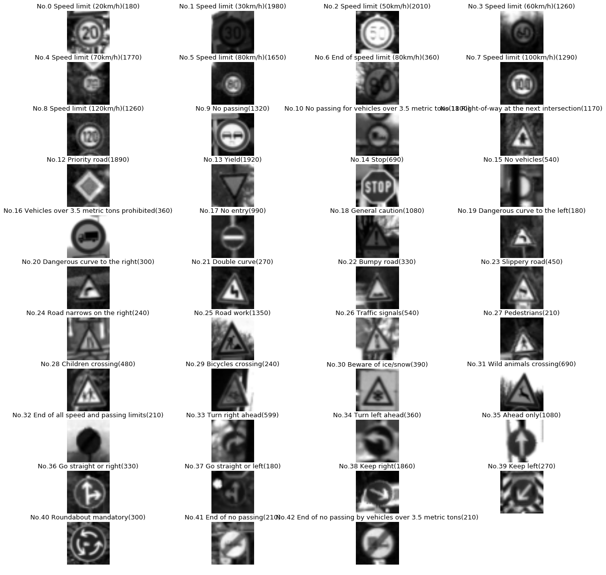

# German Traffic Sign Classification 


The goal of this project is to build a classifier to recognize taffic signs using deep neural networks and convolutional neural networks. We will train and validate a model so it can classify traffic sign images using the [German Traffic Sign Dataset](http://benchmark.ini.rub.de/?section=gtsrb&subsection=dataset).


## Pipeline description
My pipeline consists of 8 Steps :</br>

1. [Loading Data](#loading-data)</br>
2. [Dataset Summary and Exploratory](#dataset-summary-and-exploratory)</br>
3. [Data Preprocessing](#data-preprocessing)</br>
4. [Model Architecture](#model-architecture)</br>
5. [Model Training and Solution Approach](#model-training-and-solution-approach)</br>
6. [Test Model on Test Dataset](#test-model-on-test-dataset)</br>
7. [Test Model on New Images](#test-model-on-new-images)</br>
8. [Displaying intermediate outputs](#displaying-intermediate-outputs)</br>
</br>

---
### Loading Data

Please download the [Dataset](https://s3-us-west-1.amazonaws.com/udacity-selfdrivingcar/traffic-signs-data.zip) and place it in [Data_Input](./Data_Input) folder. 

We already have three `.p` files of 32x32 resized images:
- `train.p`: The training set.
- `test.p`: The testing set.
- `valid.p`: The validation set.

We will use Python `pickle` to load the data.
We also have `signnames.csv` that actually maps labels and tarffic sign.
We can also find the code that loads data ,

```python
#Download the Data from https://s3-us-west-1.amazonaws.com/udacity-selfdrivingcar/traffic-signs-data.zip

training_file = "./Data_Input/train.p"
validation_file= "./Data_Input/valid.p"
testing_file = "./Data_Input/test.p"

with open(training_file, mode='rb') as f:
    train = pickle.load(f)
with open(validation_file, mode='rb') as f:
    valid = pickle.load(f)
with open(testing_file, mode='rb') as f:
    test = pickle.load(f)
    
# Mapping ClassID to traffic sign names
signs = []
with open('./Data_Input/signnames.csv', 'r') as csvfile:
    signnames = csv.reader(csvfile, delimiter=',')
    next(signnames,None)
    for row in signnames:
        signs.append(row[1])
    csvfile.close()
```

---
### Dataset Summary and Exploratory

The pickled data is a dictionary with 4 key/value pairs:

- `'features'` is a 4D array containing raw pixel data of the traffic sign images, (num examples, width, height, channels).
- `'labels'` is a 1D array containing the label/class id of the traffic sign. The file `signnames.csv` contains id -> name mappings for each id.
- `'sizes'` is a list containing tuples, (width, height) representing the original width and height the image.
- `'coords'` is a list containing tuples, (x1, y1, x2, y2) representing coordinates of a bounding box around the sign in the image.

Let's have an overview of the data as follows,
- `Number of training examples:  34799
- `Number of testing examples:  12630
- `Number of validation examples:  4410
- `Image data shape = (32, 32, 3)
- `Number of classes = 43
- `total train 34799. total labels: 43

The below code prints out the details about data as explained above.

```python
X_train, y_train = train['features'], train['labels']
X_valid, y_valid = valid['features'], valid['labels']
X_test, y_test = test['features'], test['labels']

#if Sum_Data==True:
# Number of training examples
n_train = X_train.shape[0]

# Number of testing examples
n_test = X_test.shape[0]

# Number of validation examples.
n_validation = X_valid.shape[0]

# What's the shape of an traffic sign image?
image_shape = X_train[0].shape

# How many unique classes/labels there are in the dataset.
n_classes = len(np.unique(y_train))

print("Number of training examples: ", n_train)
print("Number of testing examples: ", n_test)
print("Number of validation examples: ", n_validation)
print("Image data shape =", image_shape)
print("Number of classes =", n_classes)
```
we shall plot sample images from each class using `matplotlib`and code is as follows,

```python
Data_view(X_train,y_train,len(np.unique(y_train)))
```
```python
def Data_view(dataset,labels,n_classes):
    plt.rcParams['figure.figsize'] = (20.0, 20.0)
    histo = [0 for i in range(n_classes)]
    samples = {}
    for idx, l in enumerate(labels):
        histo[l] += 1
        if l not in samples:
            samples[l] = dataset[idx]
    total_class = len(set(labels))
    ncols = 4
    nrows = 11

    print("total tests {}. total labels: {}".format(len(dataset), total_class))
    _, axes = plt.subplots(nrows=nrows, ncols=ncols)

    class_idx = 0
    for r in range(nrows):
        for c in range(ncols):
            a = axes[r][c]
            a.axis('off')
            if class_idx in samples:
                cmap = 'gray' if len(samples[class_idx].shape) == 2 else None
                a.imshow(samples[class_idx],cmap=cmap)
                a.set_title("No.{} {}({})".format(class_idx, signs[class_idx], histo[class_idx]), fontsize=13)
            class_idx += 1
    plt.rcParams['figure.figsize'] = figsize_default
```

<figure>
 
 <figcaption>
 <p></p> 
 </figcaption>
</figure>

We will also try exploring the statistical view of our data set by plotting histogram for number of images in each class of Train,Validation and Test Dataset. 

```python
Data_histogram_plot(y_train, "Training examples")
Data_histogram_plot(y_valid, "Validation examples")
Data_histogram_plot(y_test, "Test examples")
```
```python
def Data_histogram_plot(dataset, label):
    hist, bins = np.histogram(dataset, bins=n_classes)
    width = 0.7 * (bins[1] - bins[0])
    center = (bins[:-1] + bins[1:]) / 2
    plt.bar(center, hist, align='center', width=width)
    plt.xlabel(label)
    plt.ylabel("Image count")
    plt.show()
```

<figure>
 
 <figcaption>
 <p></p> 
 </figcaption>
</figure>

<figure>
 
 <figcaption>
 <p></p> 
 </figcaption>
</figure>

<figure>
 
 <figcaption>
 <p></p> 
 </figcaption>
</figure>

---

### Data Preprocessing

In this step, we will apply several preprocessing steps to the input images to achieve the best possible results.
We will use the following preprocessing techniques,

- **Shuffling:** In general, we shuffle the training data to increase randomness and variety in training dataset, in order for the model to be more stable. We will use sklearn to shuffle our data.

- **Grayscaling:** Using grayscale images instead of color improves the ConvNet's accuracy. We will use `OpenCV` to convert the training images into grey scale.
<figure>
 
 <figcaption>
 <p></p> 
 </figcaption>
</figure>

- **Normalization:** Normalization is a process that changes the range of pixel intensity values. Usually the image data should be normalized so that the data has mean zero and equal variance.
<figure>
 
 <figcaption>
 <p></p> 
 </figcaption>
</figure>

The python functions used to obtain the above results are,
```python
def gray_scale(image):
   
    return cv2.cvtColor(image, cv2.COLOR_RGB2GRAY)


def image_normalize(image):

    image = (image - image.mean())/image.std()
    return image
    
def Preprocess_Data(dataset):
    
    gray_images = list(map(gray_scale, dataset))
    normalized_images=np.zeros((len(gray_images),gray_images[0].shape[0],gray_images[0].shape[1]))
    for i, img in enumerate(gray_images):
        normalized_images[i] = image_normalize(img)
    normalized_images = normalized_images[..., None]
    return normalized_images
```

---
### Model Architecture

The agenda of this repo is to design a deep learning model tat learns and can be used to recognize traffic signs. The concept we are adopting is Deep neural networks and Convolutional Neural Networks to classify the images. We choose Convolutional Neural network as it has abilities to learn hierachial invariant features thereby recognizing visal patterns.

We will go with LeNet-5 , LeNet-5 is a convolutional network designed for handwritten and machine-printed character recognition. It was introduced by the famous [Yann LeCun](https://en.wikipedia.org/wiki/Yann_LeCun) in his paper [Gradient-Based Learning Applied to Document Recognition](http://yann.lecun.com/exdb/publis/pdf/lecun-01a.pdf) in 1998. Although this ConvNet is intended to classify hand-written digits, we're confident it have a very high accuracy when dealing with traffic signs, given that both hand-written digits and traffic signs are given to the computer in the form of pixel images

The Architecture is as follows,

Input => Convolution => ReLU => Pooling => Convolution => ReLU => Pooling => FullyConnected => ReLU => FullyConnected

**Layer 1 (Convolutional):** The output shape should be 28x28x6.

**Activation.** Used Relu, Feel free to use your choice of activation function.

**Pooling.** The output shape should be 14x14x6.

**Layer 2 (Convolutional):** The output shape should be 10x10x16.

**Activation.** Used Relu, Feel free to use your choice of activation function.

**Pooling.** The output shape should be 5x5x16.

**Flattening:** Flatten the output shape of the final pooling layer such that it's 1D instead of 3D.

**Layer 3 (Fully Connected):** This should have 120 outputs.

**Activation.** Used Relu, Feel free to use your choice of activation function.

**Layer 4 (Fully Connected):** This should have 84 outputs.

**Activation.** Used Relu, Feel free to use your choice of activation function.

**Layer 5 (Fully Connected):** This should have 10 outputs.

We are just using the same architecture with some tweaking though, We have added two dropout layers one after layer 2 activation and other one is after Flattening . This is regularization technique used to avoid overfitting at the same time achieving better accuracy. 

The code for the above is as follows,
```python
def LaNet(input):
    ## Layer1
    # convolution layer: 32x32x1 -> 28x28x6
    conv1 = conv_fn(input, 32, 1, 28, 6)
    conv1 = tf.nn.relu(conv1,name='convolution0')
    # pooling: 28x28x12 -> 14x14x6
    conv1 = tf.nn.max_pool(conv1, ksize=[1,2,2,1], strides=[1,2,2,1], padding='VALID',name='convolution1')
    
    ## Layer2
    # convolution layer 14x14x6 -> 10x10x16
    conv2 = conv_fn(conv1, 14, 6, 10, 16)
    conv2 = tf.nn.relu(conv2,name='convolution2')
    conv2 = tf.nn.dropout(conv2, keep_prob_conv)
    # pooling: 10x10x16 -> 5x5x16
    conv2 = tf.nn.max_pool(conv2, ksize=[1,2,2,1], strides=[1,2,2,1], padding='VALID',name='convolution3')
    
    ## Layer3
    # Flattening: Input = 5x5x16. Output = 400
    flat = tf.contrib.layers.flatten(conv2)
    flat = tf.nn.dropout(flat, keep_prob)
    layer3 = linear_fn(flat, 400, 120)
    layer3 = tf.nn.relu(layer3)
    
    ## Layer4
    layer4 = linear_fn(layer3, 120, 84)
    layer4 = tf.nn.relu(layer4)
    
    ## Layer 5
    output = linear_fn(layer4, 84, 43)
    return output
    
def conv_fn(input, in_WH, in_D, out_WH, out_D):

    filter_WH = in_WH - out_WH + 1
    strides = [1,1,1,1]
    W = tf.Variable(tf.truncated_normal(shape=(filter_WH, filter_WH, in_D, out_D), \
                                        mean = mu, stddev = sigma))
    b = tf.Variable(tf.zeros(out_D))
    model = tf.nn.conv2d(input, W, strides=strides, padding='VALID') + b
    return model
    
def linear_fn(input, in_WH, out_WH):
    W = tf.Variable(tf.truncated_normal(shape=(in_WH, out_WH), \
                                        mean=mu, stddev = sigma))
    b = tf.Variable(tf.zeros(out_WH))
    model = tf.matmul(input, W) + b
    return model
    
```

---
### Model Training and Solution Approach

In this step, we will train our model using Preprocessed Images.
Attached below is the image, Showing how the validation accuracy was improved and I will explain through the steps that helped us to achieve them. The primary goal was to reach Validation Accuracy greater than 93%.

<figure>
 
 <figcaption>
 <p></p> 
 </figcaption>
</figure>

As seen above we have increased our validation accuracy from 89% to 96%. To achieve this there were some tweaks done such as,

- **Dropout:** Overfitting is a serious problem in deep nural networks. Dropout is a technique for addressing this problem.
The key idea is to randomly drop units (along with their connections) from the neural network during training. This prevents units from co-adapting too much. During training, dropout samples from an exponential number of different “thinned” networks. At test time, it is easy to approximate the effect of averaging the predictions of all these thinned networks by simply using a single unthinned network that has smaller weights. This significantly reduces overfitting and gives major improvements over other regularization methods.
The keep_prob and keep_prob_conv variables will be used to control the dropout rate when training the neural network.

- **Data Preprocessing:** Initially for normalisation I was dividing the pixel values by 255 assuming that would fetch good results, But later I had a huge jump over when different normalisation technique was used.

- **Parameters Tuning:** 
     * EPOCHS = 50
     * BATCH_SIZE = 64
     * learning_rate = 0.001
     * Dropout at Conv 2 layer = 0.7
     * Dropout at FC 1 layer = 0.5
     
```python
## Model Training & Solution Approach

x = tf.placeholder(tf.float32, (None, 32, 32, 1))
y = tf.placeholder(tf.int32, (None))
keep_prob = tf.placeholder(tf.float32) 
keep_prob_conv = tf.placeholder(tf.float32)
LaNet_Logits=LaNet(x)
one_hot_y = tf.one_hot(y, n_classes)
cross_entropy = tf.nn.softmax_cross_entropy_with_logits_v2(logits=LaNet_Logits, labels=one_hot_y)
loss_operation = tf.reduce_mean(cross_entropy)
optimizer = tf.train.AdamOptimizer(learning_rate = 0.001)
training_operation = optimizer.minimize(loss_operation)
correct_prediction = tf.equal(tf.argmax(LaNet_Logits, 1), tf.argmax(one_hot_y, 1))
accuracy_operation = tf.reduce_mean(tf.cast(correct_prediction, tf.float32))

saver = tf.train.Saver()
model_file = './models'

EPOCHS = 50
BATCH_SIZE = 64

def train(X_data, y_data,X_val,y_val):
    with tf.Session() as sess:
        sess.run(tf.global_variables_initializer())
        print("starting ...")
        for i in range(EPOCHS):
            X_train, y_train = shuffle(X_data, y_data)
            for offset in range(0, len(X_train), BATCH_SIZE):
                end = offset + BATCH_SIZE
                features, labels = X_train[offset:end], y_train[offset:end]
                sess.run(training_operation, feed_dict={x: features, y: labels, keep_prob : 0.5, keep_prob_conv: 0.7})
            validation_accuracy  = evaluate(X_val, y_val)
            print("EPOCH {} : Validation Accuracy = {:.3f}%".format(i+1, (validation_accuracy*100)))

        saver.save(sess, model_file);
        print("Model saved ")
        
X_val=Preprocess_Data(X_valid)
train(Preprocessed_data,y_train,X_val,y_valid)
```
---
### Test Model on Test Dataset

Now, we'll use the testing set to measure the accuracy of the model over unknown examples.
We've been able to reach a Test accuracy of 94.7%.

The below code is used to run the test dataset throught the model,
```python
## Test Dataset Model Architecture
test_preprocessed=Preprocess_Data(X_test)
with tf.Session() as sess:
#    tf.reset_default_graph()
    saver.restore(sess, model_file)
    y_pred = Predict(test_preprocessed,LaNet_Logits)
    test_accuracy = sum(y_test == y_pred)/len(y_test)
    print("Test Accuracy = {:.1f}%".format(test_accuracy*100))
    
def Predict(X_data,logits,BATCH_SIZE=64):
    num_examples = len(X_data)
    y_pred = np.zeros(num_examples, dtype=np.int32)
    sess = tf.get_default_session()
    for offset in range(0, num_examples, BATCH_SIZE):
        batch_x = X_data[offset:offset+BATCH_SIZE]
        y_pred[offset:offset+BATCH_SIZE] = sess.run(tf.argmax(logits, 1), 
                           feed_dict={x:batch_x, keep_prob:1, keep_prob_conv:1})
    return y_pred
```
make sure the probablities of dropout to be set 1 durin predictions, The Dropout probablities are to be kept only during training process

---
### Test Model on New Images

In this step, we will use the model to predict  5 random traffic signs from the web to estimate our model's performance on these images.
Number of new testing examples:  5

<figure>
 
 <figcaption>
 <p></p> 
 </figcaption>
</figure>

We also have recorded the top 5 Probablities for our model prediction and they are as follows,
<figure>
 
 <figcaption>
 <p></p> 
 </figcaption>
</figure>

One common observation is most of the time the probablity is nearly 100% for simple signs but when it comes to complex traffic sign like speed limit having almost same features the model prediction probablity drops.

---

### Displaying intermediate outputs

While neural networks can be a great learning device they are often referred to as a black box, here we will explore a technique that lets us shine a light into that black box and see closer what it looks like on the inside by observing the kind of shadows that are formed. These shadows will be our feature maps, and after successfully training your neural network you can see what it's feature maps look like by plotting the output of the network's weight layers in response to a test stimuli image, which will be our light. From these plotted feature maps, it's possible to see what characteristics of an image the network finds interesting. 

-**Featuremap of conv1 Layer**:
The shape of this layer is 28x28x6 and this featuremap is for Right-of-way at the next Intersection sign class.
<figure>
 
 <figcaption>
 <p></p> 
 </figcaption>
</figure>

-**Featuremap of conv1 Pooling Layer**:
The shape of this layer is 14x14x6 and this featuremap,
<figure>
 
 <figcaption>
 <p></p> 
 </figcaption>
</figure>

-**Featuremap of conv2 Layer**:
The shape of this layer is 10x10x16 and this featuremap,
<figure>
 
 <figcaption>
 <p></p> 
 </figcaption>
</figure>

-**Featuremap of conv2 Pooling Layer**:
The shape of this layer is 5x5x16 and this featuremap,
<figure>
 
 <figcaption>
 <p></p> 
 </figcaption>
</figure>

---

## Possible improvements 
1. We can also try other preprocessing techniques to further improve the model's accuracy..
2. We can further improve on the model using hierarchical CNNs to first identify broader groups (like speed signs) and then have CNNs to classify finer features (such as the actual speed limit)
